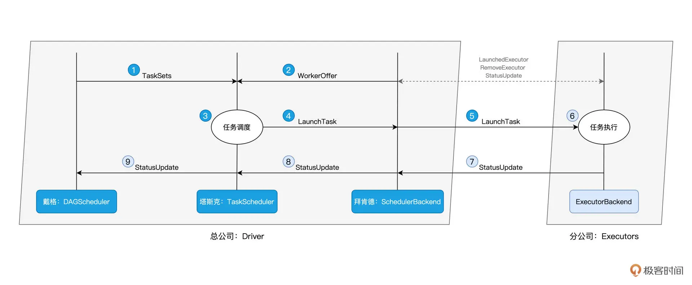

# Spark核心原理和API

## 目录

- [#1 Hello World](#1-Hello-World)
- [#2 RDD与编程模型：延迟计算](#2-RDD与编程模型延迟计算)
  - [RDD ](#RDD-)
  - [编程模型与延迟计算](#编程模型与延迟计算)
- [#3 RDD常用算子（一）：RDD内部的数据转换](#3-RDD常用算子一RDD内部的数据转换)
  - [1.创建 RDD](#1创建-RDD)
  - [2. RDD 内的数据转换](#2-RDD-内的数据转换)
  - [1) map：以元素为粒度的数据转换](#1-map以元素为粒度的数据转换)
  - [2) mapPartitions：以数据分区为粒度的数据转换](#2-mapPartitions以数据分区为粒度的数据转换)
  - [3) flatMap：从元素到集合、再从集合到元素](#3-flatMap从元素到集合再从集合到元素)
  - [4) filter：过滤 RDD](#4-filter过滤-RDD)
  - [5) mapPartitionsWithIndex](#5-mapPartitionsWithIndex)
- [#4 进程模型与分布式部署：分布式计算是怎么回事？](#4-进程模型与分布式部署分布式计算是怎么回事)
  - [1)进程模型](#1进程模型)
  - [2) spark-shell 执行过程解析](#2-spark-shell-执行过程解析)
  - [3) 分布式环境部署](#3-分布式环境部署)
- [#05 调度系统：如何把握分布式计算的精髓](#05-调度系统如何把握分布式计算的精髓)
- [#06 Shuffle管理：为什么Shuffle是性能瓶颈？](#06-Shuffle管理为什么Shuffle是性能瓶颈)
  - [Shuffle 工作原理：Shuffle 是 Map 阶段与 Reduce 阶段之间的数据交换。](#Shuffle-工作原理Shuffle-是-Map-阶段与-Reduce-阶段之间的数据交换)
  - [Shuffle 中间文件](#Shuffle-中间文件)
- [#13 Spark SQL：让我们从“小汽车摇号分析”开始](#13-Spark-SQL让我们从小汽车摇号分析开始)
- [#14 台前幕后：DataFrame与Spark SQL的由来/Catalyst 优化器\&Tungsten](#14-台前幕后DataFrame与Spark-SQL的由来Catalyst-优化器Tungsten)
  - [1）逻辑优化](#1逻辑优化)
  - [2）物理优化](#2物理优化)
  - [3）数据结构优化和执行代码优化](#3数据结构优化和执行代码优化)
- [#15 数据源与数据格式：DataFrame从何而来？](#15-数据源与数据格式DataFrame从何而来)
- [#16\* 数据转换：如何在DataFrame之上做数据处理？](#16-数据转换如何在DataFrame之上做数据处理)
  - [同源类算子](#同源类算子)
  - [探索类算子](#探索类算子)
  - [清洗类算子](#清洗类算子)
  - [转换类算子](#转换类算子)
  - [分析类算子](#分析类算子)
  - [持久化类算子](#持久化类算子)
- [#17\* 数据关联：不同的关联形式与实现机制该怎么选？](#17-数据关联不同的关联形式与实现机制该怎么选)
  - [关联形式（Join Types）](#关联形式Join-Types)
  - [实现机制（Join Mechanisms）](#实现机制Join-Mechanisms)
- [#18 数据关联优化：都有哪些Join策略，开发者该如何取舍？](#18-数据关联优化都有哪些Join策略开发者该如何取舍)
  - [结论](#结论)
  - [#19 配置项详解：哪些参数会影响应用程序执行性能？](#19-配置项详解哪些参数会影响应用程序执行性能)
  - [#20  Hive + Spark强强联合](#20--Hive--Spark强强联合)
  - [#21 Spark UI：如何高效地定位性能问题？](#21-Spark-UI如何高效地定位性能问题)
  - [#24\* 特征工程](#24-特征工程)
    - [Official Doc](#Official-Doc)
    - [1) 预处理：StringIndexer](#1-预处理StringIndexer)
    - [2) 特征选择：ChiSqSelector ](#2-特征选择ChiSqSelector-)
    - [3) 归一化：MinMaxScaler](#3-归一化MinMaxScaler)
    - [4)离散化：Bucketizer](#4离散化Bucketizer)
    - [5) Embedding](#5-Embedding)
    - [6) 向量计算](#6-向量计算)
  - [#26 ML](#26-ML)

### #1 Hello World

```python
from pyspark import SparkContext
import requests

url = "https://raw.githubusercontent.com/wulei-bj-cn/learn-spark/main/chapter01/wikiOfSpark.txt"
response = requests.get(url)
text_data = response.text

# Convert the string into an RDD
rdd = sc.parallelize(text_data.split("\n"))

textFile = rdd
wordCount = (
    textFile.flatMap(lambda line: line.split(" "))
    .filter(lambda word: word != "")
    .map(lambda word: (word, 1))
    .reduceByKey(lambda x, y: x + y)
    .sortBy(lambda x: x[1], False)
    .take(5)
)
print(wordCount)
```


### #2 RDD与编程模型：延迟计算

#### RDD&#x20;

- 是一种抽象，是 Spark 对于分布式数据集的抽象，它用于囊括所有内存中和磁盘中的分布式数据实体。
  - 每一个 RDD 都代表着一种分布式数据形态。= 比如 lineRDD，它表示数据在集群中以行（Line）的形式存在；而 wordRDD 则意味着数据的形态是单词，分布在计算集群中。
- 跟Spark的关系：是构建 Spark 分布式内存计算引擎的基石
- 跟数组比较


- 特性
  - partitions：数据分片
  - partitioner：分片切割规则
    - 后续的这些 RDD，分别继承了前一个 RDD 的 partitioner 属性。
  - dependencies：RDD 依赖
    - 每个 RDD 都会通过 dependencies 属性来记录它所依赖的前一个、或是多个 RDD，简称“父 RDD”
  - compute：转换函数
    - RDD 使用 compute 属性，来记录从父 RDD 到当前 RDD 的转换操作。

#### 编程模型与延迟计算

- 参数是函数、或者返回值是函数的函数，我们把这类函数统称为“高阶函数”Higher-order Functions
- RDD 算子的第一个共性：RDD 转换。
- 延迟计算Lazy Evaluation
  - 开发者调用的各类 Transformations 算子，并不立即执行计算，当且仅当开发者调用 Actions 算子时，之前调用的转换算子才会付诸执行
    
  - 常用算子分类
    - Transformations 类算子：定义并描述数据形态的转换过程
    - Actions 类算子，将计算结果收集起来、或是物化到磁盘。
      

### #3 RDD常用算子（一）：RDD内部的数据转换

#### 1.创建 RDD

- 内部数据/小数据：通过 SparkContext.parallelize 在内部数据之上创建 RDD；
  ```python
  # Create an RDD
  words = ["Spark", "is", "cool"]
  rdd = sc.parallelize(words) #通过 SparkContext.parallelize 在内部数据之上创建 RDD；

  ```

- 通过 SparkContext.textFile 等 API 从外部数据创建 RDD。
  ```python
  # Define root path and file path
  file = f"./wikiOfSpark.txt"

  # Read the file content into an RDD
  line_rdd = spark.sparkContext.textFile(file)
  ```


#### 2. RDD 内的数据转换

#### 1) map：以元素为粒度的数据转换

```python
def f(word):
    return (word, 1)
    
# Create an RDD
words = ["Spark", "is", "cool"]
rdd = sc.parallelize(words)
cleanWordRDD = rdd.map(f)

# Print the RDD elements
print(cleanWordRDD.collect())
```


#### 2) mapPartitions：以数据分区为粒度的数据转换

```python
%python

from hashlib import md5

words = ["Spark", "is", "cool"]
rdd = sc.parallelize(words)

# 使用mapPartitions来处理每个分区的数据，并计算MD5
kvRDD = rdd.mapPartitions(lambda partition: (
    md5(word.encode('utf-8')).hexdigest() for word in partition
))

print(kvRDD.collect())

        
        

%scala 
// 把普通RDD转换为Paired RDD
 
import java.security.MessageDigest
 
val cleanWordRDD: RDD[String] = _ // 请参考第一讲获取完整代码
 
val kvRDD: RDD[(String, Int)] = cleanWordRDD.mapPartitions( partition => {
  // 注意！这里是以数据分区为粒度，获取MD5对象实例
  val md5 = MessageDigest.getInstance("MD5")
  val newPartition = partition.map( word => {
  // 在处理每一条数据记录的时候，可以复用同一个Partition内的MD5对象
    (md5.digest(word.getBytes()).mkString,1)
  })
  newPartition
})

```


#### 3) flatMap：从元素到集合、再从集合到元素

1. 以元素为单位，创建集合(下图步骤1，2）；
2. 去掉集合“外包装”，提取集合元素（下图步骤3）。


#### 4) filter：过滤 RDD

判定函数的返回结果类型则必须是布尔值

```python
# Define filter function
def f(s: str) -> bool:
    return 'k' in s  # Keep elements that contain 'k'

words = ["Spark", "is", "cool"]
rdd = sc.parallelize(words)

# Filter RDD
cleanedPairRDD = rdd.filter(f)

# Collect and print results
print(cleanedPairRDD.collect())

```


#### 5) mapPartitionsWithIndex

1. 对于我们今天学过的 4 个算子，再加上没有详细解释的 mapPartitionsWithIndex，你能说说，它们之间有哪些共性或是共同点吗？3. 你能说一说，在日常的工作中，还遇到过哪些可以在 mapPartitions 中初始化的共享对象呢？

### #4 进程模型与分布式部署：分布式计算是怎么回事？

分布式计算的精髓在于，如何把抽象的计算流图，转化为实实在在的分布式计算任务，然后以并行计算的方式交付执行

#### 1)进程模型

Driver 与 Executors：包工头与施工工人

> Driver 最核心的作用，在于解析用户代码、构建计算流图，然后将计算流图转化为分布式任务，并把任务分发给集群中的 Executors 交付执行。接收到任务之后，Executors 调用内部线程池，结合事先分配好的数据分片，并发地执行任务代码。

Driver的助手：在 Spark 的 Driver 进程中，DAGScheduler、TaskScheduler 和 SchedulerBackend 这三个对象通力合作，依次完成分布式任务调度的 3 个核心步骤，也就是：

1\. 根据用户代码构建计算流图；

2\. 根据计算流图拆解出分布式任务；

3\. 将分布式任务分发到 Executors 中去。


#### 2) spark-shell 执行过程解析

spark-shell 有很多命令行参数，其中最为重要的有两类：一类是用于指定部署模式的 master，另一类则用于指定集群的计算资源容量。

```python
spark-shell --master local[*] #假设你的笔记本电脑有 4 个 CPU，那么当你在命令行敲入 spark-shell 的时候，Spark 会在后台启动 1 个 Driver 进程和 3 个 Executors 进程。
```


这行代码的含义有两层。第一层含义是部署模式，其中 local 关键字表示部署模式为 Local，也就是本地部署；第二层含义是部署规模，也就是方括号里面的数字，它表示的是在本地部署中需要启动多少个 Executors，星号则意味着这个数量与机器中可用 CPU 的个数相一致。

**Shuffle** 的本意是扑克牌中的“洗牌”，在大数据领域的引申义，表示的是集群范围内跨进程、跨节点的数据交换。


#### 3) 分布式环境部署

Spark 支持多种分布式部署模式，如 Standalone、YARN、Mesos、Kubernetes。

Standalone 是 Spark 内置的资源调度器，

YARN、Mesos、Kubernetes 是独立的第三方资源调度与服务编排框架。

> Standalone 在资源调度层面，采用了一主多从的主从架构，把计算节点的角色分为 Master 和 Worker。其中，Master 有且只有一个，而 Worker 可以有一到多个。所有 Worker 节点周期性地向 Master 汇报本节点可用资源状态，Master 负责汇总、变更、管理集群中的可用资源，并对 Spark 应用程序中 Driver 的资源请求作出响应。

为了方便描述，我们把 3 台 EC2 的 hostname 分别设置为 node0、node1、node2，并把 node0 选做 Master 节点，而把 node1、node2 选做 Worker 节点。


在所有节点上准备 Java 环境并安装 Spark [（步骤 2 的“sudo wget”）](https://time.geekbang.org/column/article/419200?screen=full#:~:text=你可以参考-,这里,-的链接 "（步骤 2 的“sudo wget”）")


我们就可以依次启动 Master 和 Worker 节点


集群启动之后，我们可以使用 Spark 自带的小例子，来验证 Standalone 分布式部署是否成功。首先，打开 Master 或是 Worker 的命令行终端，然后敲入下面这个命令：

```python
MASTER=spark://node0:7077 $SPARK_HOME/bin/run-example org.apache.spark.examples.SparkPi
```


如果程序能够成功计算 Pi 值，也就是 3.14，那么说明咱们的 Spark 分布式计算集群已然就绪。

### #05 调度系统：如何把握分布式计算的精髓

Spark调度系统的核心环节与关键步骤。通过比喻，将Driver比作总公司，Executors比作分公司，DAGScheduler、TaskScheduler和SchedulerBackend则分别扮演重要角色。DAGScheduler负责提交任务调度请求，TaskScheduler负责将任务派发给合适的Executor，而SchedulerBackend则与资源管理器强绑定，提供WorkerOffer并协调人力资源。


DAGScheduler 手里有“活儿”，SchedulerBackend 手里有“人力”，TaskScheduler 的核心职能，就是把合适的“活儿”派发到合适的“人”的手里。


3巨头信息传递机制



### #06 Shuffle管理：为什么Shuffle是性能瓶颈？

Shuffle 指的是集群范围内跨节点、跨进程的数据分发。

#### Shuffle 工作原理：Shuffle 是 Map 阶段与 Reduce 阶段之间的数据交换。


#### Shuffle 中间文件

对于任意一条数据记录，Spark 先按照既定的哈希算法，计算记录主键的哈希值，然后把哈希值对 N 取模，计算得到的结果数字，就是这条记录在 Reduce 阶段的数据分区编号 P。换句话说，这条记录在 Shuffle 的过程中，应该被分发到 Reduce 阶段的 P 号分区。


Shuffle Read

### #13 Spark SQL：让我们从“小汽车摇号分析”开始

### #14 台前幕后：DataFrame与Spark SQL的由来/Catalyst 优化器\&Tungsten

相比 RDD，DataFrame 通过携带明确类型信息的 Schema、以及计算逻辑明确的转换算子，为 Spark 引擎的内核优化打开了全新的空间。

> DataFrame 是携带数据模式（Data Schema）的结构化数据，而 RDD 是不携带 Schema 的分布式数据集。恰恰是因为有了 Schema 提供明确的类型信息，Spark 才能耳聪目明，有针对性地设计出更紧凑的数据结构，从而大幅度提升数据存储与访问效率。

Spark SQL 与 Spark Core 的关系：Spark Core 负责执行，而 Spark SQL 负责优化，Spark SQL 优化过后的代码，依然要交付 Spark Core 来做执行。


#### **1）逻辑优化**

AST 语法树又叫作“执行计划”（Execution Plan）。


Parquet 格式在文件层面支持“谓词下推”（Predicates Pushdown）和“列剪枝”（Columns Pruning）这两项特性。

> 谓词下推指的是，利用像“batchNum >= 201601”这样的过滤条件，在扫描文件的过程中，只读取那些满足条件的数据文件。又因为 Parquet 格式属于列存（Columns Store）数据结构，因此 Spark 只需读取字段名为“carNum”的数据文件，而“剪掉”读取其他数据文件的过程。


从“Scan > Filter > Select”调整为“Filter > Select > Scan”，那么，相比原始的执行计划，调整后的执行计划能给 Spark Core 带来更好的执行性能。


#### **2）物理优化**

数据关联有 3 种实现方式，分别是嵌套循环连接（NLJ，Nested Loop Join）、排序归并连接（Sort Merge Join）和哈希连接（Hash Join）。

Catalyst 优化器需要结合 applyNumbersDF 与 filteredLuckyDogs 这两张表的存储大小，来决定是采用运行稳定但性能略差的 Shuffle Sort Merge Join，还是采用执行性能更佳的 Broadcast Hash Join。

#### 3）数据结构优化和执行代码优化

Tungsten 设计并实现了一种叫做 Unsafe Row 的二进制数据结构。Unsafe Row 本质上是字节数组，它以极其紧凑的格式来存储 DataFrame 的每一条数据记录，大幅削减存储开销，从而提升数据的存储与访问效率。

经过了 Tungsten 的 WSCG 优化之后，Filter、Select 和 Scan 这 3 个算子，会被“捏合”为一个函数 f。Spark Core 只需要使用函数 f 来一次性地处理每一条数据，就能消除不同算子之间数据通信的开销，一气呵成地完成计算。


### #15 数据源与数据格式：DataFrame从何而来？

文章总结了DataFrame的创建方式，包括使用createDataFrame方法和read API，以及利用隐式方法和调用toDF方法创建DataFrame。

### #16\* 数据转换：如何在DataFrame之上做数据处理？

**DataFrame 算子**


#### 同源类算子


#### 探索类算子


#### 清洗类算子


- employeesDF.na.drop 用于删除 DataFrame 中带 null 值的数据记录-&#x20;
- employeesDF.na.fill(0) 则将 DataFrame 中所有的 null 值都自动填充为整数零

#### 转换类算子


```scala
employeesDF.where(“gender = ‘Male’”) #想要过滤出所有性别为男的员工 
employeesDF.withColumnRenamed(“gender”, “sex”)#当中的“gender”重命名为“sex”
employeesDF.withColumn("crypto", hash($"age")).show #用于生成新的数据列

```


#### 分析类算子


#### 持久化类算子


### #17\* 数据关联：不同的关联形式与实现机制该怎么选？

按照它们在代码中出现的顺序，我们约定俗成地把 salaries 称作“左表”，而把 employees 称作“右表”。在探讨关联机制的时候，我们又常常把左表称作是“驱动表”，而把右表称为“基表”。

#### 关联形式（Join Types）


#### 实现机制（Join Mechanisms）

一般来说，驱动表的体量往往较大，在实现关联的过程中，驱动表是主动扫描数据的那一方。而基表相对来说体量较小，它是被动参与数据扫描的那一方。


**NLJ：Nested Loop Join** - O(M,N)


**SMJ：Sort Merge Join** - O(M+N)


**HJ：Hash Join** - O(1)


```python
# 在notebook上运行，先构建环境
from pyspark import SparkContext, SparkConf
from pyspark.sql.session import SparkSession
sc = SparkContext()
spark = SparkSession(sc)

seq=[(1, "Mike", 28, "Male"), (2, "Lily", 30, "Female"), (3, "Raymond", 26, "Male"), (5, "Dave", 36, "Male")]
employees=spark.createDataFrame(seq,['id','name','age','gender'])

seq2=[(1, 26000), (2, 30000), (4, 25000), (3, 20000)]
salaries=spark.createDataFrame(seq2,['id','salary'])

# inner join
jointDF=salaries.join(employees,'id','inner')
jointDF.show()
 
# left join
jointDF2=salaries.join(employees,'id','left')
jointDF2.show()

# right join
jointDF3=salaries.join(employees,'id','right')
jointDF3.show()

# outer join
jointDF4=salaries.join(employees,'id','outer')
jointDF4.show()

# leftsemi
jointDF5=salaries.join(employees,'id','leftsemi')
jointDF5.show()

# leftanti
jointDF6=salaries.join(employees,'id','leftanti')
jointDF6.show()
```


# #18 数据关联优化：都有哪些Join策略，开发者该如何取舍？

#### 结论


数据分发模式的角度出发，数据关联又可以分为 Shuffle Join 和 Broadcast Join 这两大类

对比了单机环境中不同 Join 机制的优劣势


分布式环境中,两种策略的优劣势对比


> Hash Join 这种算法对于内存的要求比较高，适用于内存能够容纳基表数据的计算场景。

> Sort Merge Join 就没有内存方面的限制, 参与 Join 的两张表是有序表

> NLJ 可以应付不等值关联（Non Equi Join）

### #19 配置项详解：哪些参数会影响应用程序执行性能？

AQE（Adaptive Query Execution）机制的 3 个特性，分别是 **Join 策略调整、自动分区合并、以及自动倾斜处理**。AQE 结合 Shuffle 中间文件提供的统计信息，在运行时动态地调整执行计划，从而达到优化作业执行性能的目的。

- Join 策略调整：将原本的 Shuffle Join 策略，调整为 Broadcast Join 策略的过程
- 自动分区合并：在于合并过小的数据分区，从而避免 Task 粒度过细、任务调度开销过高的问题
- 自动倾斜处理：它的用途在于拆分过大的数据分区，从而避免个别 Task 负载过高而拖累整个作业的执行性能。


### #20  Hive + Spark强强联合


### #21 Spark UI：如何高效地定位性能问题？

p


### #24\* 特征工程

#### Official Doc

[ Extracting, transforming and selecting features - Spark 3.5.4 Documentation  https://spark.apache.org/docs/latest/ml-features.html](https://spark.apache.org/docs/latest/ml-features.html " Extracting, transforming and selecting features - Spark 3.5.4 Documentation  https://spark.apache.org/docs/latest/ml-features.html")

特征工程制约着模型效果，它决定了模型效果的上限，也就是“天花板”。而模型调优，仅仅是在不停地逼近这个“天花板”而已。


**特征选择**


特征选择的动机，在于提取与预测标的关联度更高的特征，从而精简模型尺寸、提升模型泛化能力。特征选择可以从两方面入手，业务出发的专家经验和基于数据的统计分析。Spark MLlib 基于不同的统计方法，提供了多样的特征选择器（Feature Selectors），其中 ChiSqSelector 以卡方检验为基础，选择相关度最高的前 N 个特征。

#### 1) 预处理：StringIndexer

```python
#属性中的非数值字段，转换为数值字段
from pyspark.sql import SparkSession
from pyspark.ml.feature import StringIndexer

# 创建 SparkSession
spark = SparkSession.builder.appName("FeatureEngineering").getOrCreate()

# 假设 source_data_df 已经加载
source_data_df = None  # 这里需要替换为实际的 DataFrame

# 所有非数值型字段
categorical_fields = [
    "MSSubClass", "MSZoning", "Street", "Alley", "LotShape", "LandContour",
    "Utilities", "LotConfig", "LandSlope", "Neighborhood", "Condition1",
    "Condition2", "BldgType", "HouseStyle", "OverallQual", "OverallCond",
    "YearBuilt", "YearRemodAdd", "RoofStyle", "RoofMatl", "Exterior1st",
    "Exterior2nd", "MasVnrType", "ExterQual", "ExterCond", "Foundation",
    "BsmtQual", "BsmtCond", "BsmtExposure", "BsmtFinType1", "BsmtFinType2",
    "Heating", "HeatingQC", "CentralAir", "Electrical", "KitchenQual",
    "Functional", "FireplaceQu", "GarageType", "GarageYrBlt", "GarageFinish",
    "GarageQual", "GarageCond", "PavedDrive", "PoolQC", "Fence", "MiscFeature",
    "MiscVal", "MoSold", "YrSold", "SaleType", "SaleCondition"
]

#####################
# Can write a function for the script below.
#####################

# 生成对应的索引列名
index_fields = [field + "Index" for field in categorical_fields]

# 初始化工程 DataFrame
engineering_df = source_data_df

# 循环遍历所有非数值字段，使用 StringIndexer 进行转换
for field, index_field in zip(categorical_fields, index_fields):
    indexer = StringIndexer(inputCol=field, outputCol=index_field, handleInvalid="keep")
    engineering_df = indexer.fit(engineering_df).transform(engineering_df)
    engineering_df = engineering_df.drop(field)  # 删除原始列

# engineering_df 现在是转换后的 DataFrame

```


#### 2) 特征选择：ChiSqSelector&#x20;

只能用于数值型字段, 结合StringIndexer来处理非数值型数据。

第一步，使用 VectorAssembler 创建特征向量；#本质：将每一行记录当作一个整体(向量)。

```python
# Define and initialize VectorAssembler
assembler = VectorAssembler(inputCols=numeric_features, outputCol="features")

#
# Apply VectorAssembler to DataFrame
gineeringDF = assembler.transform(engineeringDF)
# engineeringDF 就包含了一个字段名为“features”的数据列，它的数据内容，就是拼接了所有数值特征的特征向量。

 Code
```


```python
from pyspark.sql.functions import col
from pyspark.sql.types import IntegerType
from pyspark.ml.feature import VectorAssembler

# List of numeric fields
numeric_fields = [
    "LotFrontage", "LotArea", "MasVnrArea", "BsmtFinSF1", "BsmtFinSF2", "BsmtUnfSF", "TotalBsmtSF",
    "1stFlrSF", "2ndFlrSF", "LowQualFinSF", "GrLivArea", "BsmtFullBath", "BsmtHalfBath", "FullBath", "HalfBath",
    "BedroomAbvGr", "KitchenAbvGr", "TotRmsAbvGrd", "Fireplaces", "GarageCars", "GarageArea", "WoodDeckSF",
    "OpenPorchSF", "EnclosedPorch", "3SsnPorch", "ScreenPorch", "PoolArea"
]

# Label field
label_fields = ["SalePrice"]

# Convert all numeric fields to IntegerType
for field in numeric_fields + label_fields:
    engineeringDF = engineeringDF.withColumn(f"{field}Int", col(field).cast(IntegerType())).drop(field)

# List of transformed numeric fields
numeric_features = [f"{field}Int" for field in numeric_fields]

# Define and initialize VectorAssembler
assembler = VectorAssembler(inputCols=numeric_features, outputCol="features")

# Apply VectorAssembler to DataFrame
gineeringDF = assembler.transform(engineeringDF)

```


第二步，基于特征向量，使用 ChiSqSelector 完成特征选择。

```python
from pyspark.ml.feature import ChiSqSelector

# Define and initialize ChiSqSelector
## 分别通过 setFeaturesCol 和 setLabelCol 来指定特征向量和预测标的。
## numTopFeatures=20：p挑选出对房价影响最重要的前 20 个特征。
selector = ChiSqSelector(featuresCol="features"
      , labelCol="SalePriceInt", numTopFeatures=20) 

# Fit ChiSqSelector on the DataFrame
chi_square_model = selector.fit(engineeringDF)

# Get selected feature indices
indices = chi_square_model.selectedFeatures.tolist()

# Retrieve original feature names based on indices
selected_features = [numeric_fields[index] for index in indices]


```


#### 3) 归一化：MinMaxScaler

当原始数据之间的量纲差异较大时，在模型训练的过程中，梯度下降不稳定、抖动较大，模型不容易收敛，从而导致训练效率较差。

MinMaxScaler


```python
from pyspark.ml.feature import VectorAssembler
from pyspark.ml.feature import MinMaxScaler


# Iterate over each numeric feature
for field in numeric_features:
    # Define and initialize VectorAssembler
    assembler = VectorAssembler(inputCols=[field], outputCol=f"{field}Vector")
    
    # Transform each field from Int to Vector type
    engineeringData = assembler.transform(engineeringData)


# Lock all vector data columns
vector_fields = [f"{field}Vector" for field in numeric_features]

# Scaled data columns
scaled_fields = [f"{field}Scaled" for field in vector_fields]

# Iterate over all vector data columns
for vector in vector_fields:
    # Define and initialize MinMaxScaler
    min_max_scaler = MinMaxScaler(inputCol=vector, outputCol=f"{vector}Scaled")
    
    # Apply MinMaxScaler for normalization
    engineeringData = min_max_scaler.fit(engineeringData).transform(engineeringData)


 基于VectorAssembler特征向量，使用 MinMaxScaler 完成归一化。
```


#### 4)离散化：Bucketizer

离散化的动机，主要在于提升特征数据的区分度与内聚性，从而与预测标的产生更强的关联。

```python
from pyspark.ml.feature import Bucketizer

# 原始字段和目标字段
field_bedroom = "BedroomAbvGrInt"
field_bedroom_discrete = "BedroomDiscrete"

# 指定离散区间
splits = [-float("inf"), 3, 5, float("inf")]  # 对应[负无穷, 2], [3, 4], [5, 正无穷]

# 创建示例DataFrame
data = [(0,), (1,), (2,), (3,), (4,), (5,), (6,)]
df = spark.createDataFrame(data, [field_bedroom])

# 定义并初始化Bucketizer
bucketizer = Bucketizer(
    inputCol=field_bedroom,
    outputCol=field_bedroom_discrete,
    splits=splits
)

# 执行离散化转换
df_bucketized = bucketizer.transform(df)

# 显示结果
df_bucketized.show()

```


#### 5) Embedding

```python
from pyspark.ml.feature import StringIndexer, OneHotEncoder
from pyspark.sql import SparkSession

# 创建 SparkSession
spark = SparkSession.builder.appName("OneHotEncoding").getOrCreate()

# 示例数据
data = spark.createDataFrame([
    (0, "A"),
    (1, "B"),
    (2, "C"),
    (3, "A"),
    (4, "B"),
    (5, "C")
], ["id", "category"])

# 需要编码的分类字段
categorical_fields = ["category"]

# 生成索引字段（StringIndexer 的输出列）
index_fields = [col + "Index" for col in categorical_fields]

# 生成 OneHotEncoder 的输出字段
ohe_fields = [col + "OHE" for col in categorical_fields]

# StringIndexer: 将类别转换为索引
indexers = [StringIndexer(inputCol=cat_col, outputCol=idx_col) 
            for cat_col, idx_col in zip(categorical_fields, index_fields)]

# OneHotEncoder: 对索引进行独热编码
encoders = [OneHotEncoder(inputCol=idx_col, outputCol=ohe_col) 
            for idx_col, ohe_col in zip(index_fields, ohe_fields)]

# 依次转换数据
from pyspark.ml import Pipeline

pipeline = Pipeline(stages=indexers + encoders)
model = pipeline.fit(data)
transformed_data = model.transform(data)

# 显示结果
transformed_data.select("id", "category", "categoryIndex", "categoryOHE").show()
 OneHotEncoder
```


#### 6) 向量计算

```python
from pyspark.ml.feature import StringIndexer, OneHotEncoder, VectorAssembler
from pyspark.ml.linalg import VectorUDT, Vectors
from pyspark.sql.functions import udf

data = spark.createDataFrame([
    (0, 1.0, 0.5, 3.0, "A"),
    (1, 2.0, 0.7, 4.0, "B"),
    (2, 3.0, 0.2, 2.0, "A"),
], ["id", "feature1", "feature2", "bedroomDiscrete", "category"])

# StringIndexer: 类别变量转换为索引
indexer = StringIndexer(inputCol="category", outputCol="categoryIndex")
data = indexer.fit(data).transform(data)

# OneHotEncoder: 进行独热编码
encoder = OneHotEncoder(inputCol="categoryIndex", outputCol="categoryOHE")
data = encoder.fit(data).transform(data)

# UDF: 将 array<double> 转换为 Vector
to_vector_udf = udf(lambda arr: Vectors.dense(arr), VectorUDT())

# 将 OneHotEncoder 结果转换为 Vector
data = data.withColumn("categoryOHE_vec", to_vector_udf("categoryOHE"))

# VectorAssembler: 合并特征列
assembler = VectorAssembler(
    inputCols=["feature1", "feature2", "bedroomDiscrete", "categoryOHE_vec"],
    outputCol="features"
)
transformed_data = assembler.transform(data)

# 显示结果
transformed_data.select("id", "features").show(truncate=False)
```


### #26 ML


